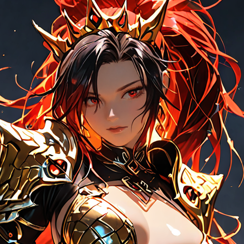
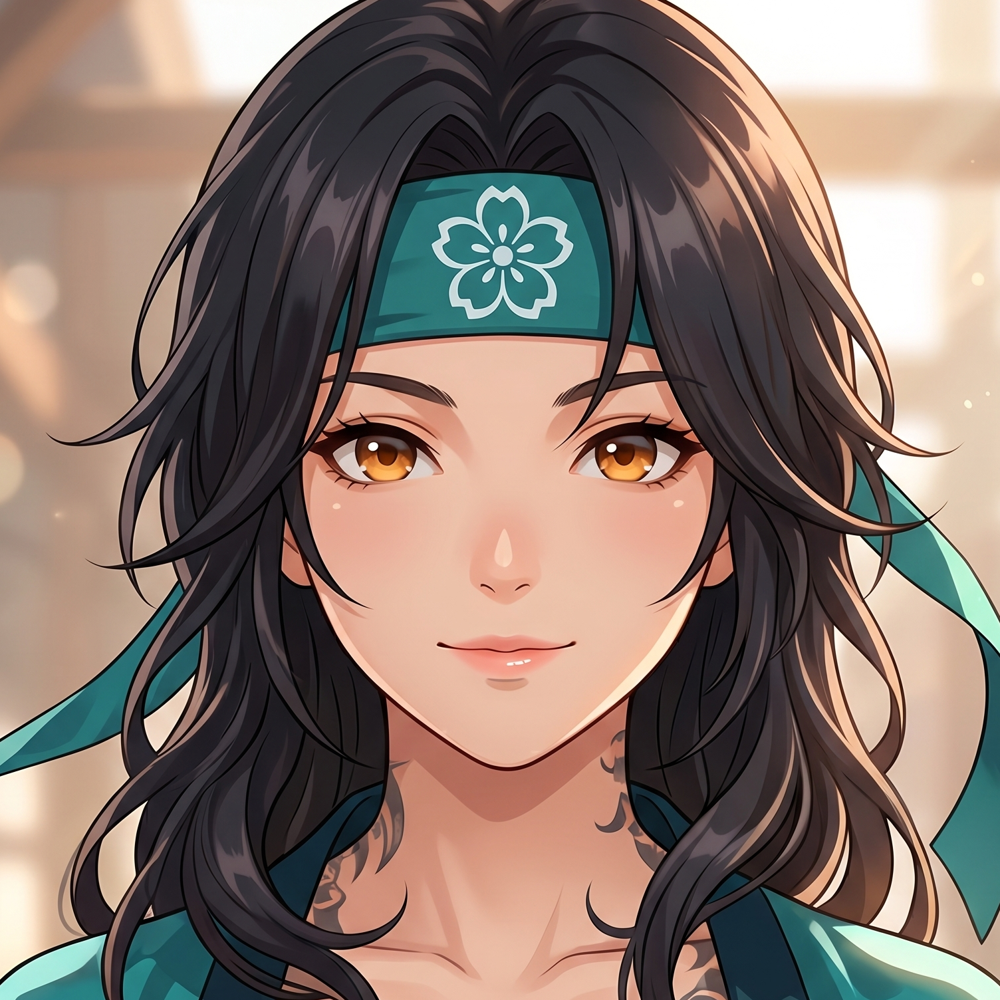

content = """# Dawn's Journey v2

A fast-paced, 2D action-RPG engine built for seamless combat, dynamic team rotations, and deep mechanical expression. Inspired by modern action titles (Genshin Impact, Wuthering Waves), DJv2 prioritizes crisp game feel, precise geometry, and composable combat primitives.

## ⚔️ The Roster

| Character | Description |
| :---: | :--- |
|  **Sefyra** | **Wind DPS / Support.** An aerial combatant utilizing the *Cloudpiercer* auto-lock bow system to rain tiered, charged shots from above. |
|  **Frosty** | **Ice Brawler.** A close-range specialist who uses omni-directional burst blasts to punish enemies that get too close. |
|  **Maria Elena** | **Shadow Summoner.** Fights in tandem with his *Revenant Wolf*, locking down priority targets with high-pressure pincer attacks. |
|  **Yara** | **Nature Healer.** Creates the *Sanctum of Verdance*, a persistent field zone that provides sustained healing and vital team buffs. |
|  **Ryoma** | **Fire Vanguard.** Wields devastating *Titanic Smash* abilities for heavy, sweeping melee finishers and large-scale crowd control. |
|  **midorima** | **Lightning Skirmisher.** Relies on fast, single-tile skillshots and rapid dashes to weave through enemy ranks with precision. |
|  **Cedric** | **Earth Defender.** Controls space with inverted T-cone sweeps to punish flankers, protect allies, and hold the frontline. |
|  **Marina** | **Hydro Enchanter.** Uses wide-line beam channeling and off-field stack bonuses to enable massive elemental reactions for the party. |

## 🛠️ Combat Engine Architecture

The core of DJv2 is its **Data Contract Philosophy**: *Characters are data, never code.* Adding a new character is simply a matter of authoring a new JSON recipe. 

* **Shape / Behavior Split:** "Shapes" (pure geometric targeting like cones, lines, and circles) are strictly separated from "Behaviors" (resolution classes like `damage_aoe`, `summon`, `dash`). This matrix allows for endless, robust combinations without bloating the engine.
* **Status Engine:** A comprehensive effect pipeline where statuses can stack, decay, modify stats, intercept damage, and transform via reaction tables.
* **Dynamic Rotations:** Fast, responsive off-field energy sharing, precise intro/outro action triggers, and lazy-recharging multi-charge abilities maintain combat momentum.
* **Strata & Terrain:** Advanced spatial logic supporting `ground`, `flying`, and `swimming` combatants, plus obstacle height and platforming interactions.

## 🚀 Getting Started

1. Clone the repository
2. Install dependencies: `npm install`
3. Run the SvelteKit dev server: `npm run dev`
4. Jump in and test the roster!

---
*Built for the love of 2D action.*
"""

with open("README.md", "w") as f:
    f.write(content)
print("[file-tag: README.md]")